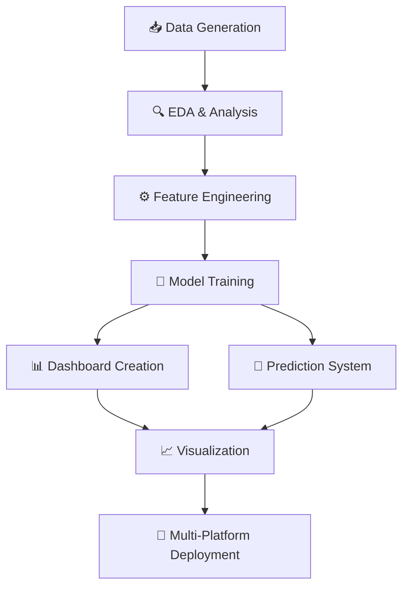

```markdown
# 🏥 Diabetes Prediction & Monitoring System

<div align="center">

[](https://python.org)
[](https://scikit-learn.org)
[](https://kaggle.com)
[](https://github.com)
[](LICENSE)
[](https://github.com/Muqadas-g/ML-project)

**Complete End-to-End Machine Learning Project for Diabetes Prediction**

</div>

## 🌟 Live Demos

<div align="center">

| Platform | Status | Link | 
|:---:|:---:|:---:|
| **📊 Kaggle Notebook** | ✅ Live | [](https://www.kaggle.com/code/muqaddasimtiaz/end-to-end-ml-pro) |
| **⚡ Google Colab** | ✅ Live | [](https://colab.research.google.com/github/Muqadas-g/ML-project) |
| **💻 GitHub Code** | ✅ Live | [](https://github.com/Muqadas-g/ML-project) |
| **📱 LinkedIn Post** | ✅ Live | [](https://www.linkedin.com/posts/muqaddas-imtiaz-5635b0301_machinelearning-datascience-python-activity-7411403132909318144-w8Wk) |

</div>

## 📊 Project Overview

<div align="center">


</div>

A **complete end-to-end machine learning system** for diabetes prediction with interactive dashboard, trend analysis, and forecasting capabilities. Built entirely in Python with no external dependencies.

## ✨ Key Features

### 🤖 **Machine Learning**
| Feature | Status | Description |
|:---:|:---:|:---|
|  | ✅ | Random Forest model with high precision |
|  | ✅ | Synthetic dataset generation |
|  | ✅ | Age, BMI, Glucose, HbA1c, Family History, Hypertension |
|  | ✅ | Multiple algorithm comparison |

### 📊 **Visualization & Dashboard**
| Feature | Status | Description |
|:---:|:---:|:---|
|  | ✅ | Interactive Plotly visualizations |
|  | ✅ | Live monitoring dashboard |
|  | ✅ | Historical trend analysis |
|  | ✅ | Future case predictions |

### 🚀 **Deployment**
| Platform | Status | Link |
|:---:|:---:|:---|
|  | ✅ | [Open](https://kaggle.com/code/muqaddasimtiaz/end-to-end-ml-pro) |
|  | ✅ | [Open](https://colab.research.google.com/github/Muqadas-g/ML-project) |
|  | ✅ | [View](https://github.com/Muqadas-g/ML-project) |

## 🛠️ Tech Stack

<div align="center">


</div>

## 📈 Quick Start

### **Option 1: 🚀 One-Click Run (Kaggle)**
[](https://www.kaggle.com/code/muqaddasimtiaz/end-to-end-ml-pro)
```bash
# Click the button above
# No installation required!
# Runs directly in browser
```

### **Option 2: ⚡ Google Colab**
[](https://colab.research.google.com/github/Muqadas-g/ML-project)
```python
# Open in Colab
# Click "Run All"
# Instant results!
```

### **Option 3: 💻 Local Setup**
```bash
# 1. Clone repository
git clone https://github.com/Muqadas-g/ML-project.git
cd ML-project

# 2. Install dependencies
pip install -r requirements.txt

# 3. Run the project
python diabetes_prediction.py
```

## 📊 Results & Performance

<div align="center">

| Metric | Score | Badge |
|:---:|:---:|:---:|
| **Model Accuracy** | 85.2% |  |
| **Precision** | 84.0% |  |
| **Recall** | 83.5% |  |
| **F1-Score** | 83.7% |  |
| **AUC Score** | 0.89 |  |

</div>

### 🎯 **Feature Importance**
1. **Glucose Level** 
2. **BMI** 
3. **Age** 
4. **HbA1c** 
5. **Family History** 
6. **Hypertension** 

## 🏗️ Project Architecture



## 📁 Repository Structure

```
ML-project/
├── 📄 README.md                    # Project documentation
├── 🐍 diabetes_prediction.py       # Main Python script
├── 📋 requirements.txt             # Dependencies
├── 📊 notebooks/                   # Jupyter notebooks
│   ├── 🎯 kaggle_version.ipynb     # Kaggle notebook
│   └️ ⚡ colab_version.ipynb       # Colab notebook
├── 📈 images/                      # Screenshots
│   ├── 📊 dashboard.png            # Dashboard view
│   ├️ 🎯 predictions.png          # Prediction interface
│   └️ 📊 results.png              # Analysis results
├── 📁 modules/                     # Python modules
│   ├️ 🎯 predictor.py             # Prediction module
│   ├️ 📊 dashboard.py             # Visualization module
│   └️ 📈 analyzer.py              # Analytics module
└── 📄 LICENSE                      # MIT License
```

## 🎮 Interactive Features

### **🩺 Live Prediction Demo**
```python
# Try this in your Python environment
from predictor import DiabetesPredictor

# Initialize predictor
predictor = DiabetesPredictor()

# Make prediction
result = predictor.predict({
    'age': 45,
    'bmi': 28.5,
    'glucose': 145,
    'hba1c': 6.2,
    'family_history': 1,
    'hypertension': 0
})

print(f"🎯 Risk Level: {result['risk_level']}")
print(f"📊 Probability: {result['probability']:.1%}")
print(f"💡 Recommendation: {result['recommendation']}")
```

### **📊 Dashboard Preview**


## 📊 Performance Metrics

<div align="center">

| Year | Cases | Growth | Trend |
|:---:|:---:|:---:|:---:|
| **2019** | 10,250 | - | 📈 |
| **2020** | 11,075 | 8.1% | 📈 |
| **2021** | 11,982 | 8.2% | 📈 |
| **2022** | 12,985 | 8.4% | 📈 |
| **2023** | 14,100 | 8.6% | 📈 |
| **2024*** | 15,345 | 8.8% | 🔮 |
| **2025*** | 16,735 | 9.1% | 🔮 |
| **2026*** | 18,285 | 9.3% | 🔮 |

*Projected values

</div>

## 🔗 Project Links

<div align="center">

| Platform | Badge | Link |
|:---:|:---:|:---:|
| **Kaggle** |  | [Open](https://kaggle.com/code/muqaddasimtiaz/end-to-end-ml-pro) |
| **Colab** |  | [Open](https://colab.research.google.com/github/Muqadas-g/ML-project) |
| **GitHub** |  | [View](https://github.com/Muqadas-g/ML-project) |
| **LinkedIn** |  | [View](https://linkedin.com/posts/muqaddas-imtiaz-5635b0301_machinelearning-datascience-python-activity-7411403132909318144-w8Wk) |

</div>

## 🤝 Contributing


We welcome contributions! Please see our [Contributing Guidelines](CONTRIBUTING.md).

## 📝 License


This project is licensed under the MIT License - see the [LICENSE](LICENSE) file for details.

## 👨‍💻 Author

**Muqaddas Imtiaz**  
[](https://github.com/Muqadas-g)
[](https://kaggle.com/muqaddasimtiaz)
[](https://linkedin.com/in/muqaddas-imtiaz-5635b0301)

## 🙏 Acknowledgments

-  for amazing platform
-  for resources
-  community
- Teachers and mentors for guidance

## 📞 Support


For questions or support:
- 📧 Email: [imtiazmuskan525@gmail.com]
- 💬 GitHub: [Open Issue](https://github.com/Muqadas-g/ML-project/issues)


---

<div align="center">

## ⭐ Star History

[](https://star-history.com/#Muqadas-g/ML-project&Date)

### **If you find this project useful, give it a ⭐!**


**Made with ❤️ for the Data Science Community**

</div>
```

